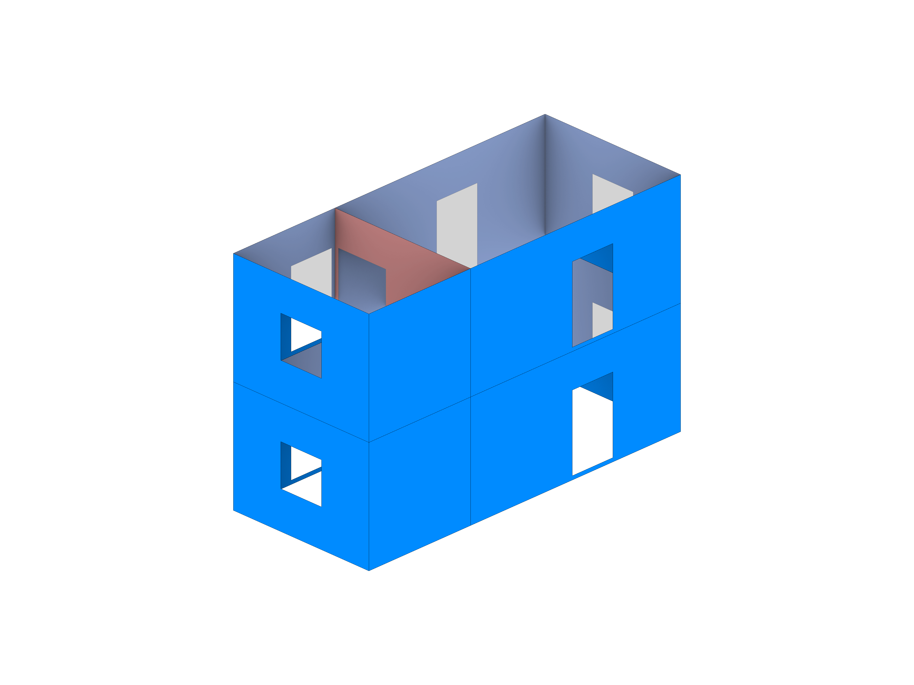

# EFM-WIP
GH based files and scripts hosted for the EFM tool.

# Description
## EFM in a nutshell...
1. Introduction
2. Schematic Workflow

# User Steps

1. Model the surfaces that need to be converted into equivalent frame elements.  

2. Layer Structure

3. GH Script

4. User Interface 

5. Result 

# Developer Steps
1. VS code Intellisense:
    - As we are not running any of the python scripts from within VSC, we only need to reference the stubs files to get the intellisense to work. 
    - Create a conda env - C:\Users\vrajasekar\.conda\envs\rhinogh (Version of python (3.9.24) - same as .rhinocode's py39-rh8)
    - Copy the stub files needed from the .rhinocode location (C:\Users\vrajasekar\.rhinocode\py39-rh8\site-stubs\rhino3d-8.15.25019.13001) to the the conda env's sitepackages directory (C:\Users\vrajasekar\.conda\envs\rhinogh\Lib\site-packages)

2. Visual Studio '22 Intellisense
    - Use the C# component of the rhino 7. The rhino c# 9.0 doesn't work with script parasite yet.
    - Limit the length of directory's path name.
    - If a single parent directory is used, the scrips of each c# component will be placed under a single solution. 

# Caveat
The UI form writes data to gh in a unidirectional manner, i.e., direct changes of input parameters does not reflect in the UI. 

"C:\DEV\EFM-WIP\Manual\links\1_srfs.png"