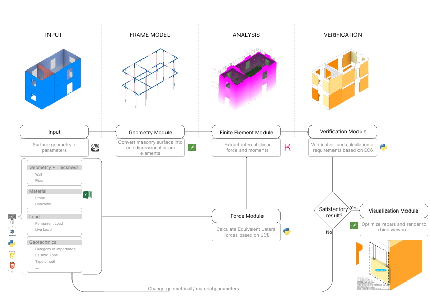
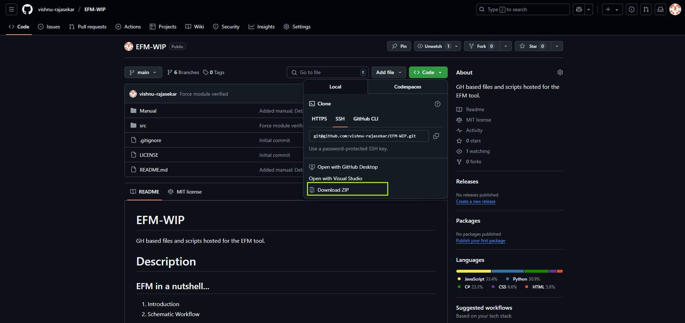
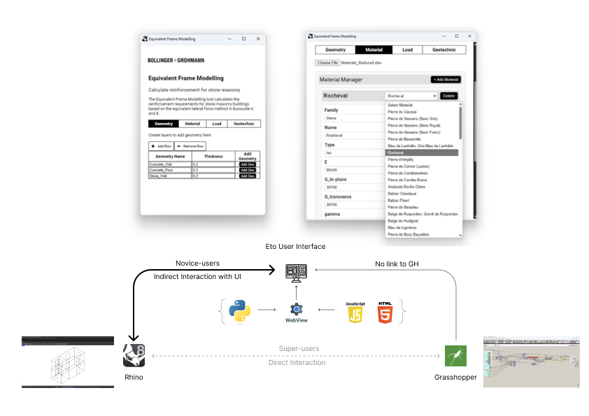
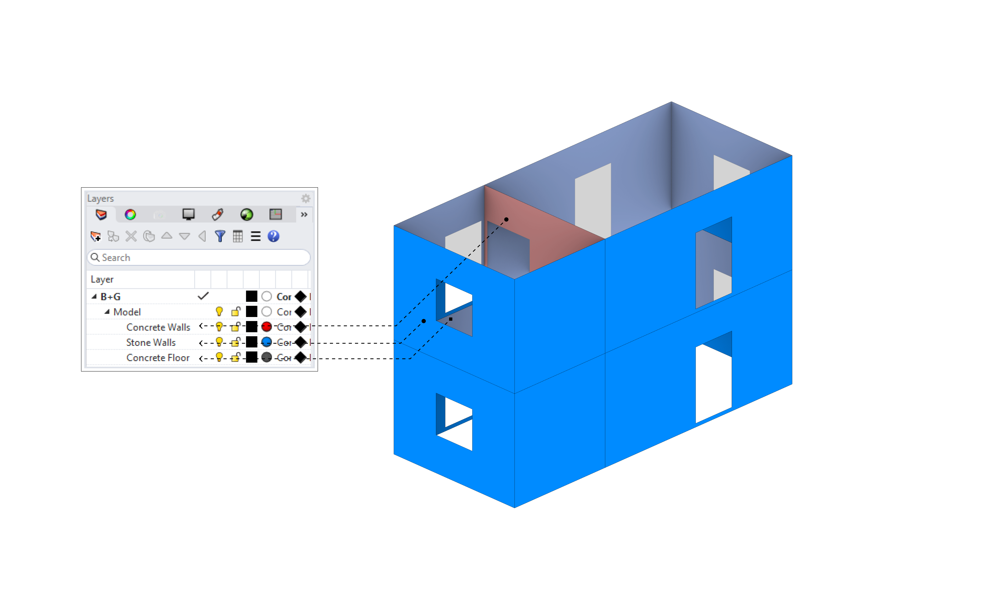
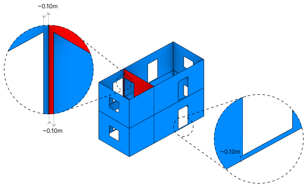

# K-EFM
Karamba-Equivalent Frame Modelling (K-EFM) is a parametric tool to rapidly analyze and optimize both unreinforced and reinforced stone masonry construction according to Eurocode 6 (for masonry structures) and Eurocode 8 (for seismic design). 

## Description

### Introduction

K-EFM (Karamba-Equivalent Frame Modelling) is a parametric tool for rapid structural analysis and design optimization of stone masonry buildings. It leverages the Karamba3D plugin for Grasshopper (GH) to convert 2D/3D masonry geometry into simplified “frame” elements. The tool automatically applies seismic forces per Eurocode 8 (EC8) and checks masonry strength requirements per Eurocode 6 (EC6).

### Schematic Workflow

**Input:** The user specifies the wall and floor geometries along with their respective thicknesses, materials (stone or concrete), loads (permanent and live), and basic geotechnical data (e.g., seismic zone, importance category, etc). These parameters define the overall building configuration.

**Geometry Module:** The tool converts the input 3D masonry surfaces into one-dimensional “equivalent frame” beam elements. This reduces the complexity of the structural model while capturing essential stiffness and mass properties.

**Finite Element Module:** A finite element analysis is run (using Karamba3D in Grasshopper) on the generated frame elements, extracting internal forces and bending moments.

**Force Module:** Equivalent lateral seismic forces are calculated in accordance with Eurocode 8 (EC8), incorporating information such as seismic zone and building importance category.

**Verification Module:** The tool checks the resulting internal forces against the design requirements of Eurocode 6 (EC6), evaluating whether the masonry sections are adequately sized and reinforced.

**Visualization Module:** If the verification fails, the user can adjust geometry or material properties and re-run the analysis. If satisfactory, the tool can optimize reinforcement bar layouts (in reinforced masonry cases) and render the results (e.g., in Rhino’s viewport).

<!--  -->

    
    <em>Schematic workflow of K-EFM</em>

## User Manual

### Installation 

1. Rhino 7 (or higher).
2. Karamba3D plugin.
3. ScriptParasite plugin & Visual Studio Community 2022 to open the c# scripts in VS (Optional) 

### Setup

1. To download the reposiroty, one can either clone it using git or directly download as shown below.  

<!--  -->

<figure align="center">
    
    <figcaption>Downloading the repo</figcaption>
</figure>

2. Locate and the K-EFM.ghx file from src\WorkingFiles of the repository.

### Usage

The tool allows for two modes of interaction with the GH script to input parameters and vizualize the results. The first is <ins>*Direct Interaction*</ins>, where the gh super-users direclty interact with GH definition to input data, change calculation/ verification parameters and visualize the results. The second is <ins>*Indirect Interaction*</ins> for non-expert gh users can interact with the definition using a user-friendly dialog box. The following image and section explains the two modes of interaction. 

<figure  align="center">
    
    <figcaption>Modes of interaction with the GH definition</figcaption>
</figure >

[x] Indicate the button that lets the user toggle between direct and indirect mode

**Direct Interaction:**

**1. Rhino Modelling:** Model the wall and roof surfaces which need to be converted into equivalent frame elements. Openings for door and windows need to be trimmed from the surface. Once created, add these surfaces into the layers, that are structured to take *concrete* walls, *stone* walls and conrete *floors* as inputs. 

<figure align="center">
    
    <figcaption>Input geometries as surface</figcaption>
</figure>

> [!WARNING]  
> For surfaces with opening within them, the opening should be offset by approx. 0.10m from the outer boundary of the surface. 
> <figure align="center">
>    
>    <figcaption>Input geometries as surface</figcaption>
> </figure>

**2. GH Reference:** <ins>Sync Mode</ins>—For smaller models, the geometry pipeline components automatically reads the surfaces in the rhino layers and feeds them into the definition. This enables real-time feedback for changes in geomtry of the building. <ins>Async Mode</ins>—Howvewer, for larger building, it is ideal to reference the geometries into geometric containers directly in Grasshopper. 

<figure align="center">
    
    <figcaption>Pipeline reads </figcaption>
</figure>

3. GH Script

4. User Interface 

5. Result 

**Indirect Interaction:**

# Developer Steps
1. VS code Intellisense:
    - As we are not running any of the python scripts from within VSC, we only need to reference the stubs files to get the intellisense to work. 
    - Create a conda env - C:\Users\vrajasekar\.conda\envs\rhinogh (Version of python (3.9.24) - same as .rhinocode's py39-rh8)
    - Copy the stub files needed from the .rhinocode location (C:\Users\vrajasekar\.rhinocode\py39-rh8\site-stubs\rhino3d-8.15.25019.13001) to the the conda env's sitepackages directory (C:\Users\vrajasekar\.conda\envs\rhinogh\Lib\site-packages)

2. Visual Studio '22 Intellisense
    - Use the C# component of the rhino 7. The rhino c# 9.0 doesn't work with script parasite yet.
    - Limit the length of directory's path name.
    - If a single parent directory is used, the scrips of each c# component will be placed under a single solution. 

# Caveat
The UI form writes data to gh in a unidirectional manner, i.e., direct changes of input parameters do not get reflected back in the UI. 

"C:\DEV\EFM-WIP\Manual\links\1_srfs.png"